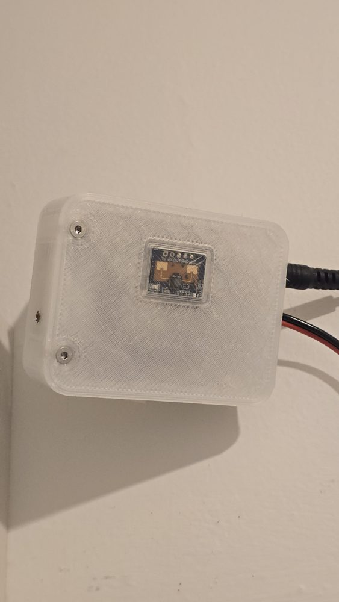
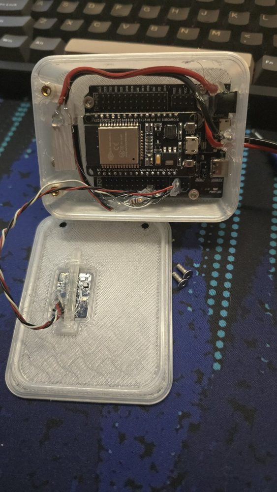
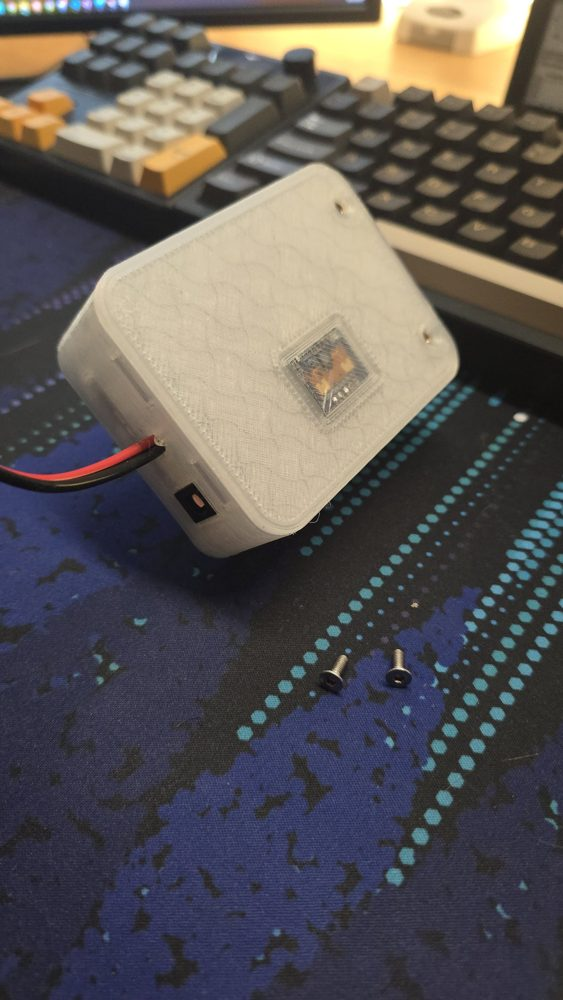
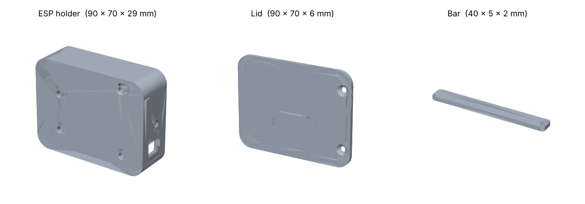

# Human-Detecting Lights

Room lights that turn themselves on when someone is actually *in* the room, and off when they leave. It uses a **24 GHz mmWave presence sensor (HLK-LD2410C)** rather than a PIR, so it keeps the lights on while you're sitting still. When presence is detected, an ESP32 fades up a 12 V LED strip and switches on a **Kasa HS200 smart light switch** over Wi-Fi. When the room empties, everything fades back off.

*Mounted on the wall. The LD2410C radar sits behind the window in the lid.*

## How it works

- The LD2410C's presence output pin is read once a second.
- **Someone present →** the LED strip fades up (PWM through a MOSFET) and the Kasa switch is turned on.
- **Room empty →** the Kasa switch turns off and the strip fades down to off.
- **Night mode (10:00pm–06:00am):** the strip comes on at a dimmer level (`LED_NIGHT_BRIGHTNESS`) and the Kasa switch is left **off**, so you get a soft night light instead of the main room lights.
- Time comes from NTP, with a POSIX time-zone string (`PST8PDT,...` by default).
- If the Kasa switch isn't found at boot, the sketch keeps re-scanning the network for it.

## Hardware

- ESP32 dev board (plus a GPIO breakout board)
- HLK-LD2410C mmWave radar presence sensor
- Kasa Smart Light Switch HS200
- 12 V LED light strip and a 12 V power supply
- Logic-level MOSFET and resistors to drive the strip
- 3D-printed enclosure: see [Enclosure](#enclosure)

### Pins

| Signal | ESP32 GPIO |
|---|---|
| LED strip PWM (to MOSFET gate) | 27 |
| LD2410C presence output | 12 |

## Enclosure

| Inside | Closed up |
|---|---|
|  |  |
| The ESP32 on a breakout board, screwed into the holder, with the LED-strip MOSFET on the left. The LD2410C is glued into the pocket in the lid and held by the printed bar. The lid screws into brass heat-set inserts. | Closed up: the radar shows through the window in the lid. The power jack and the LED-strip leads come out of the side. |

The printable parts are in `STL Files/`:

| File | Part |
|---|---|
| `Big ESP holder.STL` | Main case, 90 × 70 × 29 mm. Holds the ESP32 breakout board, with a cut-out for the power jack |
| `Big ESP holder lid.STL` | Lid with the pocket and window for the LD2410C |
| `bar.STL` | Bar that holds the LD2410C in the lid's pocket |

GitHub can show the STL files in 3D: open one there to rotate it.

## Setup

This is a [PlatformIO](https://platformio.org/) project; the VS Code extension is the easiest way to use it. `platformio.ini` sets the board and pins the libraries, so there's nothing to install by hand:

| Library | Version | Notes |
|---|---|---|
| [KasaSmartPlug](https://github.com/kj831ca/KasaSmartPlug) | pinned to a commit | Not in the PlatformIO registry, so it's pulled from GitHub |
| ArduinoJson | 6.x | KasaSmartPlug uses the v6 API |
| Arduino-ESP32 core | 2.x (`espressif32@6.9.0`) | The firmware uses the `ledcSetup` PWM API, which core 3.x removed |

1. Copy `include/secrets.example.h` to `include/secrets.h` and set:
   - `WIFI_SSID` / `WIFI_PASSWORD`: your Wi-Fi
   - `SWITCH_NAME`: the name of your Kasa switch exactly as it appears in the Kasa app

   `secrets.h` is git-ignored, so your Wi-Fi password can't be committed by accident.
2. Optional, in `src/main.cpp`: `time_zone` (POSIX TZ string), `LED_DAY_BRIGHTNESS`, `LED_NIGHT_BRIGHTNESS`, `START_NIGHT`, `END_NIGHT`.
3. `pio run -t upload`, then `pio device monitor`. The serial monitor (115200) lists every Kasa device found on the network, which helps if the switch name doesn't match.

## Files

| Path | Purpose |
|---|---|
| `src/main.cpp` | ESP32 firmware |
| `include/secrets.example.h` | Template for your Wi-Fi details and switch name |
| `platformio.ini` | Board, build settings and libraries |
| `STL Files/` | 3D-printable enclosure parts (see [Enclosure](#enclosure)) |
| `docs/` | README images |
